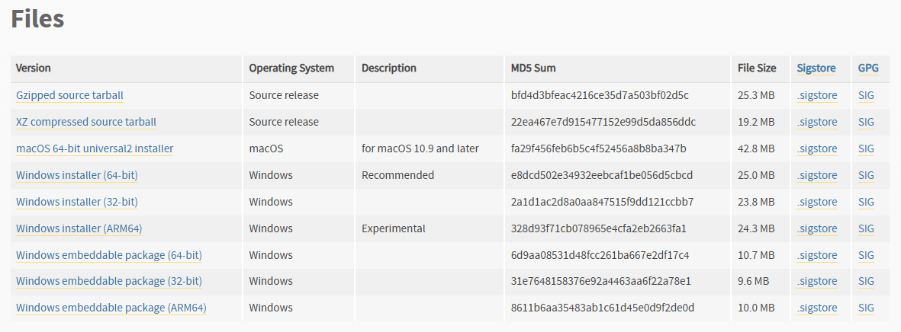
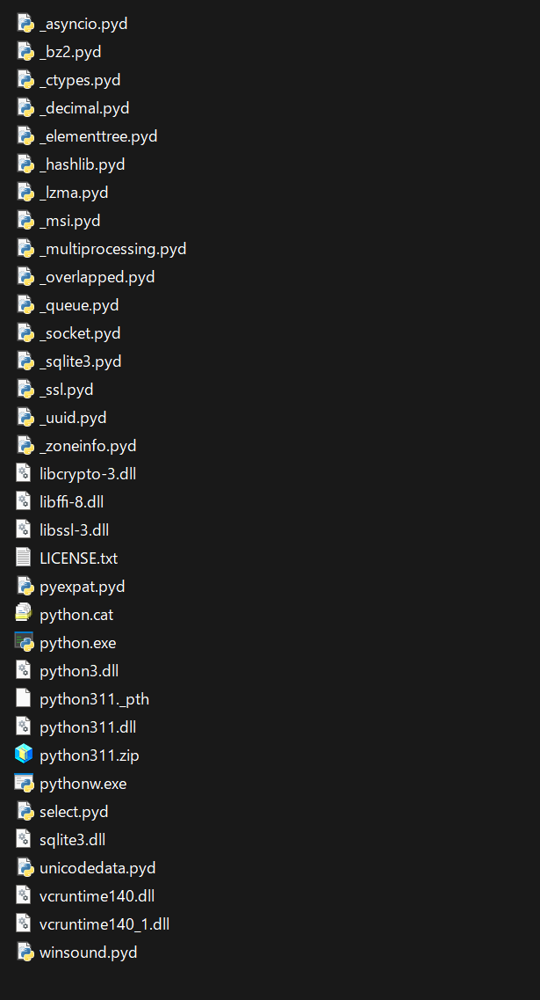
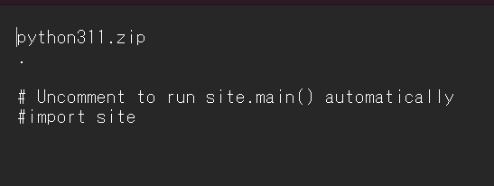
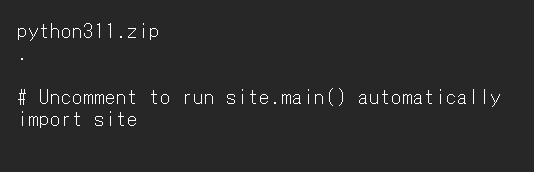

# Portable Python on USB Drive

A complete guide to create a portable Python environment on a USB drive that can run on any Windows computer without requiring Python installation.

## Table of Contents
- [日本語版](#日本語版)
- [English Version](#english-version)

---

# 日本語版

## 概要

このガイドでは、USBドライブにPython 3.11.9（64ビット）をセットアップし、管理者権限なしで任意のWindowsコンピューターで使用できる完全にポータブルな環境を作成する方法を説明します。

## 必要なもの

- USBドライブ（最小2GB推奨）
- Windowsコンピューター（64ビット）
- Pythonとパッケージをダウンロードするためのインターネット接続

## ステップ1：Python組み込みパッケージのダウンロード

1. Python公式リリースページにアクセス: https://www.python.org/downloads/release/python-3119/
2. 「Files」セクションまでスクロール
3. "Windows embeddable package (64-bit)"をダウンロード: `python-3.11.9-embed-amd64.zip`



## ステップ2：PythonをUSBに展開

1. USBドライブを挿入（例：ドライブレター `E:`）
2. USBドライブにフォルダーを作成: `E:\PortablePython`
3. `python-3.11.9-embed-amd64.zip`の内容を`E:\PortablePython`に展開

フォルダー構造は以下のようになります：
```
E:\PortablePython\
├── python.exe
├── python311.dll
├── python311._pth
├── pythonw.exe
└── ... (その他のファイル)
```



## ステップ3：.pthファイルの変更

`python311._pth`ファイルは、Pythonがモジュールを検索するパスを制御します。

1. テキストエディタで`E:\PortablePython\python311._pth`を開く
2. 元の内容は以下のようになっています：
```
python311.zip
.

# Uncomment to run site.main() automatically
#import site
```

3. 以下のように変更します：
```
python311.zip
.
Lib
Lib\site-packages

# Uncomment to run site.main() automatically
import site
```

4. **重要**: pip機能を有効にするため、`import site`の前の`#`を削除してください
5. ファイルを保存





## ステップ4：pipのインストール

1. 以下から`get-pip.py`をダウンロード: https://bootstrap.pypa.io/get-pip.py
2. `E:\PortablePython\`に保存
3. コマンドプロンプトを開き、USBドライブに移動：
```cmd
E:
cd E:\PortablePython
```

4. pipをインストール：
```cmd
python.exe get-pip.py --no-warn-script-location
```

5. pipのインストールを確認：
```cmd
python.exe -m pip --version
```

## ステップ5：追加ライブラリのインストール

### 単一のパッケージをインストール：
```cmd
python.exe -m pip install requests --no-warn-script-location
```

### 複数のパッケージをインストール：
```cmd
python.exe -m pip install numpy pandas matplotlib --no-warn-script-location
```

### requirements.txtからインストール：
```cmd
python.exe -m pip install -r requirements.txt --no-warn-script-location
```

## ステップ6：Pythonスクリプトの実行

### 方法1：バッチファイル（.bat）を使用

USBドライブに`run_script.bat`という名前のファイルを作成：

```batch
@echo off
REM このバッチファイルがあるディレクトリに移動
cd /d %~dp0

REM ポータブルPythonへのパスを設定
set PYTHON_HOME=%~dp0PortablePython
set PATH=%PYTHON_HOME%;%PATH%

REM Pythonスクリプトを実行
%PYTHON_HOME%\python.exe your_script.py

REM 出力を確認するために一時停止（オプション）
pause
```

### 方法2：Bashスクリプト（.sh）を使用（Git BashまたはWSL用）

`run_script.sh`という名前のファイルを作成：

```bash
#!/bin/bash

# このスクリプトが配置されているディレクトリを取得
SCRIPT_DIR="$( cd "$( dirname "${BASH_SOURCE[0]}" )" && pwd )"

# Pythonパスを設定
PYTHON_HOME="$SCRIPT_DIR/PortablePython"

# Pythonスクリプトを実行
"$PYTHON_HOME/python.exe" your_script.py

# ユーザー入力を待つ（オプション）
read -p "Enterキーを押して続行"
```

実行可能にする（Git Bashで）：
```bash
chmod +x run_script.sh
```

### 方法3：直接実行

USBドライブに移動して実行：
```cmd
E:\PortablePython\python.exe E:\your_script.py
```

## プロジェクト構造の例

```
E:\
├── PortablePython\
│   ├── python.exe
│   ├── python311.dll
│   ├── python311._pth
│   ├── Lib\
│   └── Scripts\
├── my_project\
│   ├── main.py
│   ├── requirements.txt
│   └── data\
├── run_script.bat
└── run_script.sh
```

## トラブルシューティング

### 問題：「No module named 'pip'」
- `python311._pth`で`import site`のコメントを外したか確認
- `get-pip.py`を使用してpipを再インストール

### 問題：スクリプトが実行されない
- batch/bashファイル内の`python.exe`へのパスが正しいか確認
- USBドライブのドライブレターが変更されていないか確認

### 問題：DLLエラーが発生
- 64ビット組み込みパッケージをダウンロードしたか確認
- すべてのファイルが正しく展開されているか確認

## メリット

- ✅ ターゲットコンピューターへのインストールが不要
- ✅ 管理者権限が不要
- ✅ 異なるマシン間で一貫したPython環境
- ✅ バックアップと共有が簡単
- ✅ システムのPythonインストールから分離

## 注意事項

- ドライブレターは異なるコンピューターで変わる可能性があります（E:、F:など）
- 可能な限りスクリプト内で相対パスを使用してください
- バッチファイルの`%~dp0`とbashスクリプトの`$SCRIPT_DIR`は現在の場所を自動的に検出します

---

# English Version

## Overview

This guide will help you set up Python 3.11.9 (64-bit) on a USB drive, making it completely portable and usable on any Windows computer without administrative privileges.

## Requirements

- USB drive (minimum 2GB recommended)
- Windows computer (64-bit)
- Internet connection for downloading Python and packages

## Step 1: Download Python Embeddable Package

1. Visit the official Python releases page: https://www.python.org/downloads/release/python-3119/
2. Scroll down to the "Files" section
3. Download **Windows embeddable package (64-bit)**: `python-3.11.9-embed-amd64.zip`


## Step 2: Extract Python to USB

1. Insert your USB drive (e.g., drive letter `E:`)
2. Create a folder on the USB drive: `E:\PortablePython`
3. Extract the contents of `python-3.11.9-embed-amd64.zip` to `E:\PortablePython`

Your folder structure should look like:
```
E:\PortablePython\
├── python.exe
├── python311.dll
├── python311._pth
├── pythonw.exe
└── ... (other files)
```


## Step 3: Modify the .pth File

The `python311._pth` file controls which paths Python searches for modules.

1. Open `E:\PortablePython\python311._pth` with a text editor
2. The original content looks like this:
```
python311.zip
.

# Uncomment to run site.main() automatically
#import site
```

3. Modify it to:
```
python311.zip
.
Lib
Lib\site-packages

# Uncomment to run site.main() automatically
import site
```

4. **Important**: Remove the `#` before `import site` to enable pip functionality
5. Save the file


## Step 4: Install pip

1. Download `get-pip.py` from: https://bootstrap.pypa.io/get-pip.py
2. Save it to `E:\PortablePython\`
3. Open Command Prompt and navigate to your USB drive:
```cmd
E:
cd E:\PortablePython
```

4. Install pip:
```cmd
python.exe get-pip.py --no-warn-script-location
```

5. Verify pip installation:
```cmd
python.exe -m pip --version
```


*Screenshot showing the pip installation process in Command Prompt*


*Screenshot showing successful pip version check*

## Step 5: Install Additional Libraries

### Install a single package:
```cmd
python.exe -m pip install requests --no-warn-script-location
```

### Install multiple packages:
```cmd
python.exe -m pip install numpy pandas matplotlib --no-warn-script-location
```

### Install from requirements.txt:
```cmd
python.exe -m pip install -r requirements.txt --no-warn-script-location
```


*Screenshot showing package installation with pip*

## Step 6: Running Python Scripts

### Method 1: Using Batch File (.bat)

Create a file named `run_script.bat` in your USB drive:

```batch
@echo off
REM Change to the directory where this batch file is located
cd /d %~dp0

REM Set the path to portable Python
set PYTHON_HOME=%~dp0PortablePython
set PATH=%PYTHON_HOME%;%PATH%

REM Run your Python script
%PYTHON_HOME%\python.exe your_script.py

REM Pause to see output (optional)
pause
```


*Screenshot showing the batch file content in a text editor*


*Screenshot showing the batch file execution in Command Prompt*

### Method 2: Using Bash Script (.sh) for Git Bash or WSL

Create a file named `run_script.sh`:

```bash
#!/bin/bash

# Get the directory where this script is located
SCRIPT_DIR="$( cd "$( dirname "${BASH_SOURCE[0]}" )" && pwd )"

# Set Python path
PYTHON_HOME="$SCRIPT_DIR/PortablePython"

# Run your Python script
"$PYTHON_HOME/python.exe" your_script.py

# Wait for user input (optional)
read -p "Press enter to continue"
```

Make it executable (in Git Bash):
```bash
chmod +x run_script.sh
```


*Screenshot showing the bash script content in a text editor*


*Screenshot showing the bash script execution in Git Bash*

### Method 3: Direct Execution

Navigate to your USB drive and run:
```cmd
E:\PortablePython\python.exe E:\your_script.py
```

## Example Project Structure

```
E:\
├── PortablePython\
│   ├── python.exe
│   ├── python311.dll
│   ├── python311._pth
│   ├── Lib\
│   └── Scripts\
├── my_project\
│   ├── main.py
│   ├── requirements.txt
│   └── data\
├── run_script.bat
└── run_script.sh
```


*Screenshot showing the complete folder structure in Windows Explorer*

## Troubleshooting

### Issue: "No module named 'pip'"
- Make sure you uncommented `import site` in `python311._pth`
- Reinstall pip using `get-pip.py`

### Issue: Scripts not running
- Check that the path to `python.exe` is correct in your batch/bash file
- Ensure your USB drive letter hasn't changed

### Issue: Missing DLL errors
- Make sure you downloaded the 64-bit embeddable package
- Verify all files were extracted correctly

## Benefits

- ✅ No installation required on target computers
- ✅ No administrative privileges needed
- ✅ Consistent Python environment across different machines
- ✅ Easy to backup and share
- ✅ Isolated from system Python installations

## Notes

- The drive letter may change on different computers (E:, F:, etc.)
- Use relative paths in your scripts when possible
- The `%~dp0` in batch files and `$SCRIPT_DIR` in bash scripts automatically detect the current location

---

## License

This guide is provided as-is for educational purposes.

## Contributing

Feel free to submit issues or pull requests to improve this guide.

## Author

Created for portable Python development
